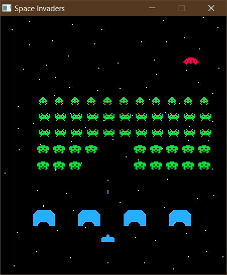

# SpaceInvadersASM

## Prerequisites

- NASM
- GCC
- SDL2 2.26.5
- SDL2_image 2.6.3
- SDL2_mixer 2.6.3

## Building

1. Copy SDL2.lib, SDL2_image.lib and SDL2_mixer.lib in ext folder
1. `make`

## Running

1. Copy SDL2.dll, SDL2_image.dll and SDL2_mixer.dll in out folder
1. `./out/space_invaders.exe`

## Controls

Press space key to fire laser shots.
Press left or right keys to move left or right respectively.
